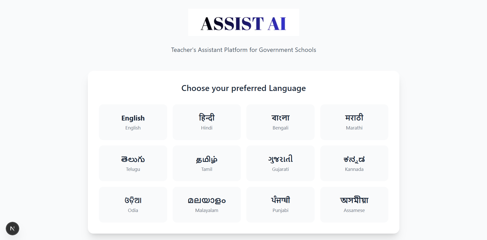
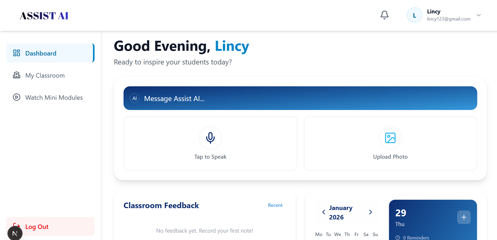
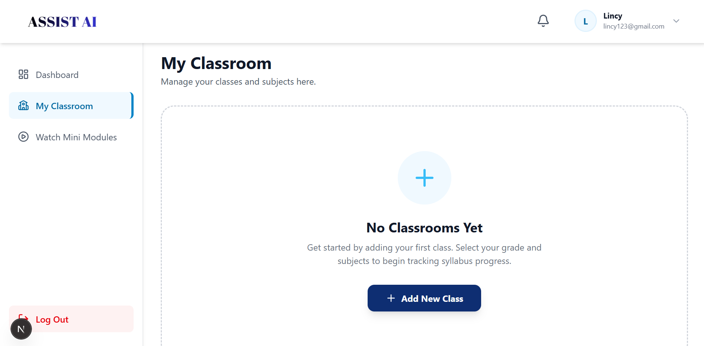
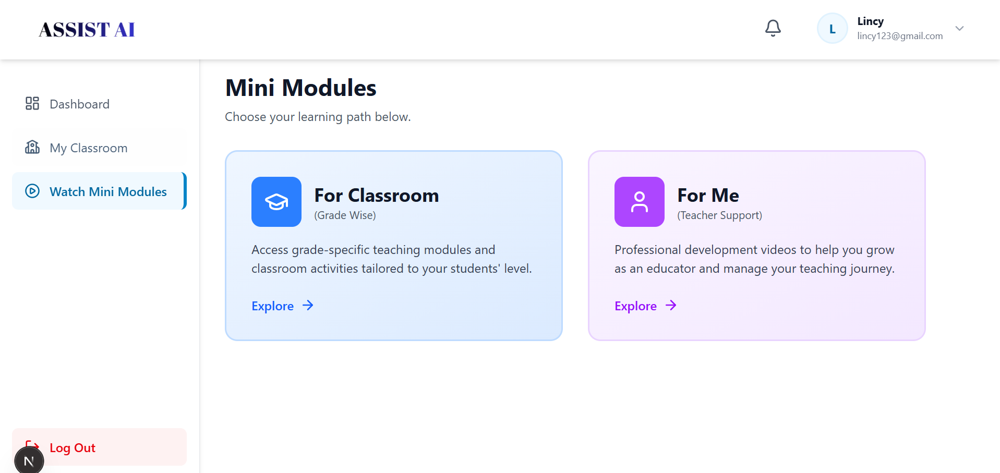

# Assist AI - Teacher's Digital Companion

**Empowering Government School Teachers with AI & Native Language Support.**

Assist AI is a comprehensive digital platform designed to support teachers in government schools by providing AI-driven tools, classroom management resources, and professional development modules—all accessible in their local language.

##  Core Features

### 1.  Multilingual AI Assistant
-   **Voice & Text Interaction**: Teachers can speak or type in their native language.
-   **Real-time AI**: Powered by Google Gemini 2.0 Flash for instant lesson planning, doubt resolution, and resource generation.
-   **12+ Indian Languages**: Seamless translation and interaction in Hindi, Kannada, Tamil, Telugu, and more.

### 2. Smart Feedback & Reflection
-   **AI Analysis**: Teachers can input their daily classroom experiences.
-   **Structured Feedback**: The AI analyzes inputs to provide:
    -    Good Things (Accomplishments)
    -    Areas of Concern
    -    Improvement Suggestions
-   **Retry Logic**: One-click re-analysis for simplified bullet points if strict clarity is needed.

### 3.  Smart Calendar & Notifications
-   **Integrated Planner**: Manage classroom schedules and reminders.
-   **Time-Aware Notifications**: Real-time banners and badge alerts that trigger *exactly* when a task is due.
-   **Visual Updates**: Dynamic red badge counts for pending tasks.

### 4.  Mini Modules & Resources
-   **Professional Development**: Curated video content for teacher training (Classroom Management, Stress Management, etc.).
-   **Grade-Wise Content**: subject-specific modules for students (Grades 1-10).

### 5.  Inclusive Design
-   **Simple UI**: Glassmorphism design tailored for ease of use.
-   **Accessibility**: High contrast text, clear icons, and intuitive navigation.

---

##  Technology Stack

-   **Frontend**: [Next.js 16](https://nextjs.org/) (React, TypeScript), Tailwind CSS.
-   **Backend**: [FastAPI](https://fastapi.tiangolo.com/) (Python), Uvicorn.
-   **Database**: [MongoDB](https://www.mongodb.com/) (Atlas).
-   **AI Engine**: Google Gemini API (2.0 Flash).
-   **Speech Services**: Web Speech API for Speech-to-Text.

---

##  Getting Started

Follow these steps to set up the project locally.

### Prerequisites
-   [Node.js](https://nodejs.org/) (v18+)
-   [Python](https://www.python.org/) (v3.9+)
-   [MongoDB](https://www.mongodb.com/) (Atlas URI)

### 1. Clone the Repository
```bash
git clone https://github.com/your-username/AINexus-Duality.git
cd AINexus-Duality
```

### 2. Backend Setup
Navigate to the backend directory and set up the Python environment.

```bash
cd backend

# Create virtual environment (optional but recommended)
python -m venv venv
# Windows
.\venv\Scripts\activate
# Linux/Mac
source venv/bin/activate

# Install dependencies
pip install -r requirements.txt
```

**Configuration**:
Create a `.env` file in `backend/` with your credentials:
```env
MONGODB_URI=your_mongodb_atlas_uri
GEMINI_API_KEY=your_google_gemini_api_key
SECRET_KEY=your_jwt_secret_key
```

**Run Server**:
```bash
uvicorn main:app --reload
# Backend will start at http://localhost:8000
```

### 3. Frontend Setup
Open a new terminal and navigate to the frontend directory.

```bash
cd frontend

# Install dependencies
npm install

# Run Development Server
npm run dev
# Frontend will start at http://localhost:3000
```

---

##  Usage Flow

1.  **Register/Login**: Sign up as a Teacher.
2.  **Dashboard**: You will land on the Dashboard with access to Calendar, Feedback info, and Quick Actions.
3.  **Chat**: Click the center Mic button to start talking to Assist AI.
4.  **Feedback**: Go to "Classroom Feedback" to log your daily reflection.
5.  **Profile**: Manage your details via the Profile menu.

---

## 📸 Application Screenshots

<div align="center">
  
  <br/>
  
  <br/>
  
  <br/>
  
</div>

Made with ❤️ for Education.
